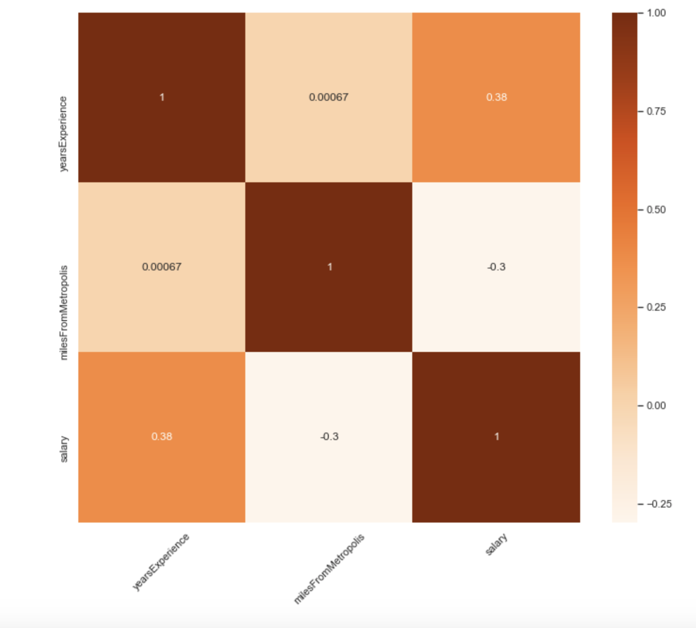
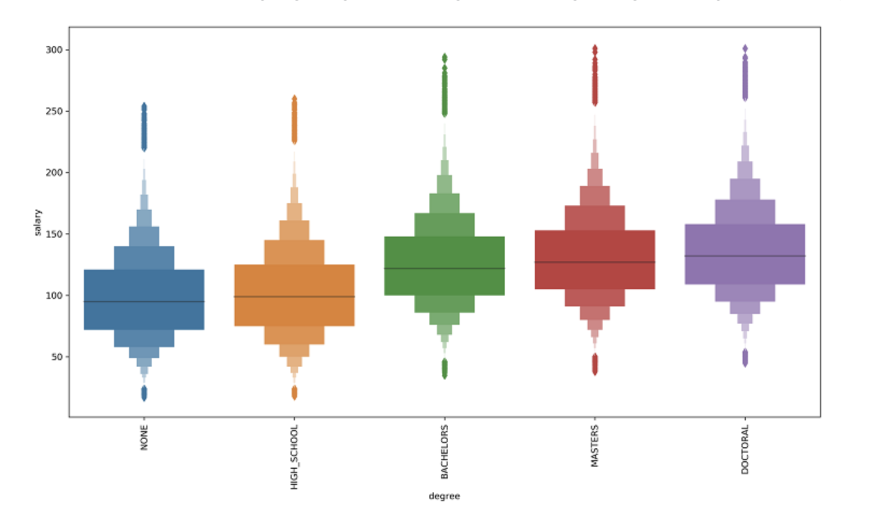
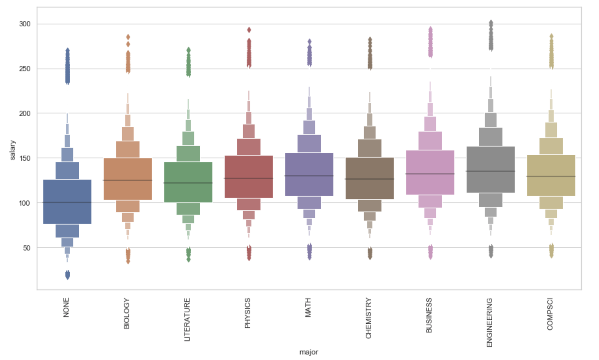
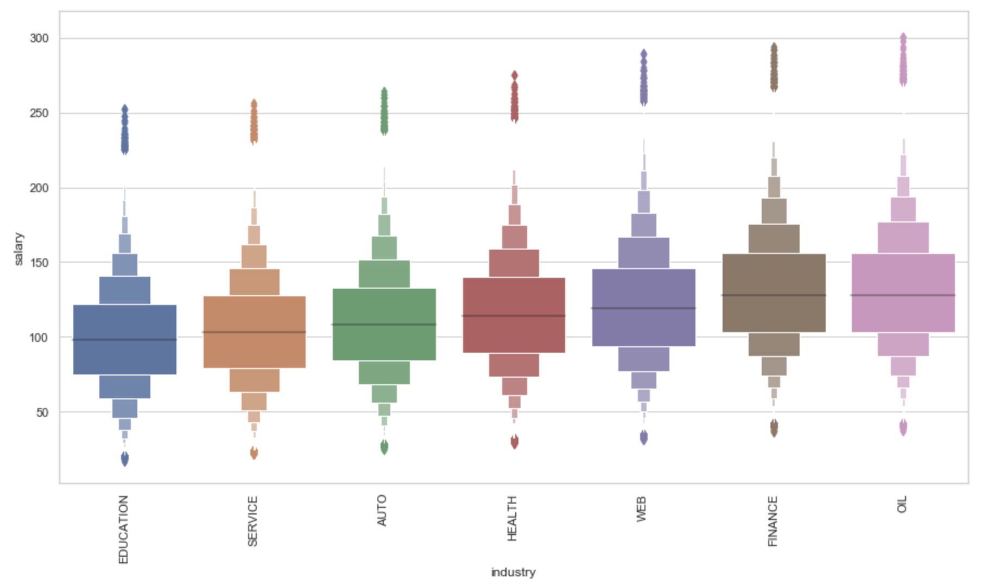

# salaryPredictionPortfolio
Salary Prediction Project (Python)

# BUSINESS PROBLEM
  
  With the given set of data, can we develop a model that predicts the salary of employees for a specific job and profile? How accurate can the model be? 
  In this situation, we will develop a machine learning model to predict the salary for various different job postings.
  
# Data 

 The data set is provided in two csv files 'train_features.csv' which contains attributes of each job posting and 'train_salaries.csv’ that has salaries for each corresponding job posting.For the future operations with the data I combined two data sets into a one performing inner join using jobID as a Foreign key.
 
# Pre-processing 

  In this stage, more focus was on finding duplicates and missing values. After performing necesary data pre-processing steps we came to a conclusion that there were no duplicates or missing values. After analyzing the dataset, we found out 5 insignificant values i.e Salary <= 0 in the dataset. These values were removed from the dataset.
  
# Exploratory Data Analysis

  Exploratory Data analysis was performed on the dataset in-order to identify the relationship between the attributes and target variable. As a result, we found out that yearsExperience and salary show a positive correlation whereas milesFromMetropolis show negative correlation with salary. The correlation matrix is as follows:
   

 
This shows a negative correlation between salary and milesFromMetropolis. As miles tend to increase the salaries get decreased.

 
This graph depicts that as yearsOfExperince increases our salaries increases. Basically it depicts an positive correlation between yearsExperience and salary.

As we can see as position increases salary tends to increase. So there is an positive correlation between salary and jobType.

As we move up the higher grade, we see a rise in payment of employees. So the target variable salary is positive correlated with degree.

Below pic clearly depicts that most number of salaries are offerred to engineering and business employees.

As we can see that, oil and finance industry employees have almost the same payment. 

# Modeling

 After performing exploratory data analysis, we identified the hidden patterns in the dataset. Based on those insights respective models were taken into consideration for salary prediction. Models taken into consideration were 
 
     1. Linear Regression (LR)
     2. Random Forest (RF) 
     3. Gradient Boosting algorithm (GB). 
  
 In-order to carry out the efficacy of model, the evaluation Metric MSE was taken into consideration. Random Forest had the lowest MSE value of 366.6 and hence was considered as an production model.

# Feature Importance

 Being an ensemble method Random Forest gives an opportunity to inspect feature importances and get a sense of which of the variables have the most effect on the model. Using ‘feature importances’ method I derived this information, stored in a separate data frame and built a plot visualizing importance of each variable in a descending order.

 As we can clearly see from the figure, yearsExperience is the most significant feature for predicting the salary of employees followed by jobType_JANITOR and milesFromMetropolis. On the other side we have degree and major features which are of least important. Feature importance does play an important role in identifing key features in the dataset which can have a major impact for model prediction.
 
# Conclusion

   The Random forest algorithm predicted the salary depending upon the job postings with an MSE - 366.6. Also we can see that the important features identified were milesFromMetropolis, yearsExperience, jobType which played an major role in predicting the salaries for different job postings. These results can be helpful for job seekers to assess their expectations of salary based on their known parameters such as miles from Metropolis, years of experience, education, industry and job type. It also can be useful to develop an approach for those job seekers who is looking for higher salaries. For example, one of the strongest salary predictors is miles from Metropolis, so a candidate can decide whether to move closer to Metropolis or just find a job there and commute.
   
   This salary prediction can further be improved by taking into considerations various features like projects, extra hours, acknowledgements, etc. With the help of these features and proper tunning of hyperparameters more effective results can be reproduced regarding salary predictions.

