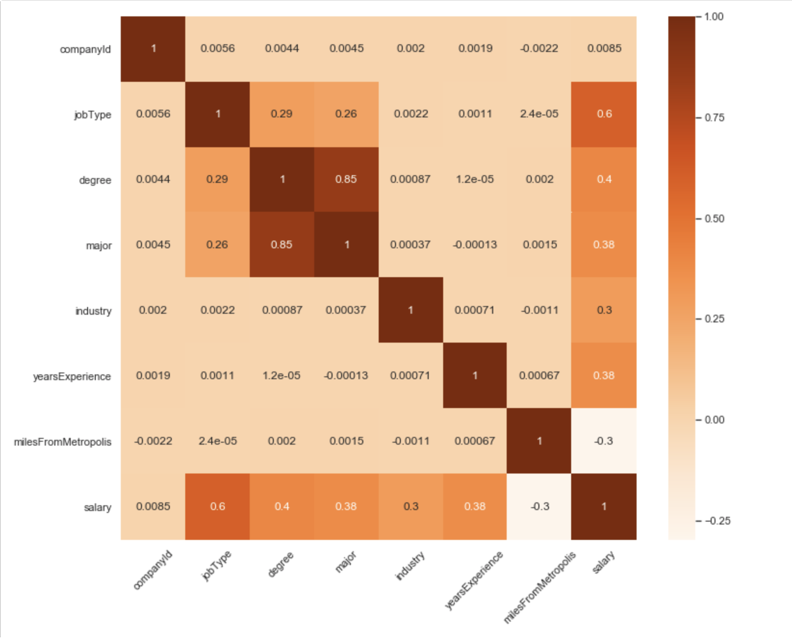
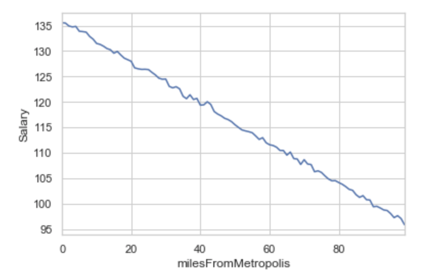
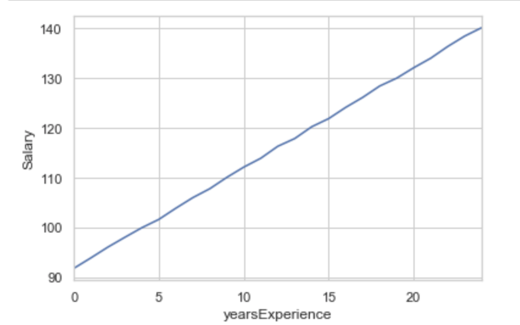
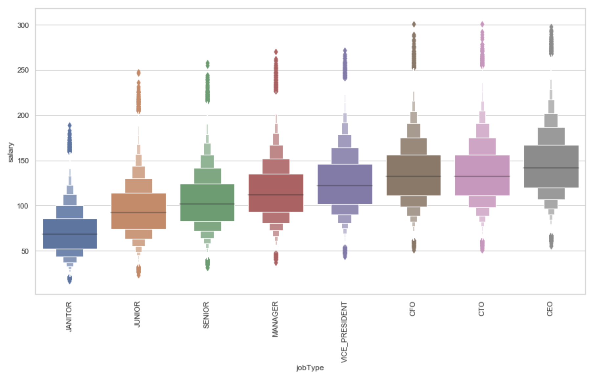

# salaryPredictionPortfolio
Salary Prediction Project (Python)

# BUSINESS PROBLEM
  
  With the given set of data, can we develop a model that predicts the salary of employees for a specific job and profile? How accurate can the model be? 
  In this situation, we will develop a machine learning model to predict the salary for various different job roles.
  
# Data 

 The data set is provided in two csv files 'train_features.csv' which contains attributes of each job posting and 'train_salaries.csv’ that has salaries for each corresponding job posting.For the future operations with the data I combined two data sets into a one performing inner join using jobID as a Foreign key.
 
# Pre-processing 

  In this stage, more focus was on finding duplicates and missing values. After performing necesary data pre-processing steps we came to a conclusion that there were no duplicates or missing values. After analyzing the dataset, we found out 5 insignificant values i.e Salary <= 0 in the dataset. These values were removed from the dataset.
  
# Exploratory Data Analysis

  Exploratory Data analysis was performed on the dataset in-order to identify the relationship between the attributes and target variable. As a result, we found out that yearsExperience and salary show a positive correlation whereas milesFromMetropolis show negative correlation with salary. The correlation matrix is as follows:
   

 
This shows a negative correlation between salary and milesFromMetropolis. As miles tend to increase the salaries get decreased.

 
This graph depicts that as yearsOfExperince increases our salaries increases. Basically it depicts an positive correlation between yearsExperience and salary.

As we can see as position increases salary tends to increase. So there is an positive correlation between salary and jobType.

